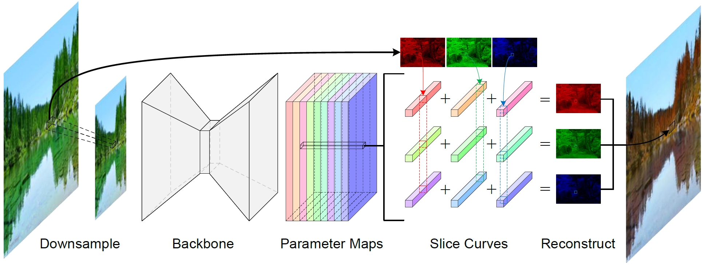

# Multi-Curve Translator for High-Resolution Photorealistic Image Translation

[](https://arxiv.org/abs/2203.07756) [](https://drive.google.com/drive/folders/1RWALNnNNxoTxxgjuKGRSw98SGrQhZ_uO?usp=sharing)
[](https://pan.baidu.com/s/1x345BOI2c8mBecdNvazZqA?pwd=u514)

Multi-Curve Translator (MCT) is a plug-in module that enables some photorealistic image-to-image translation methods to process high-resolution images in real-time.
This repository provides the implementation of CycleGAN's MCT variant and the newly collected dataset.




> **Abstract:** 
The dominant image-to-image translation methods are based on fully convolutional networks, which extract and translate an image's features and then reconstruct the image.
However, they have unacceptable computational costs when working with high-resolution images.
To this end, we present the Multi-Curve Translator (MCT), which not only predicts the translated pixels for the corresponding input pixels but also for their neighboring pixels.
And if a high-resolution image is downsampled to its low-resolution version, the lost pixels are the remaining pixels' neighboring pixels.
So MCT makes it possible to feed the network only the downsampled image to perform the mapping for the full-resolution image, which can dramatically lower the computational cost.
Besides, MCT is a plug-in approach that utilizes existing base models and requires only replacing their output layers.
Experiments demonstrate that the MCT variants can process 4K images in real-time and achieve comparable or even better performance than the base models on various photorealistic image-to-image translation tasks.

## Getting started

### Install

We test the code on PyTorch 1.8.1 + CUDA 11.3 + cuDNN 8.2.0. Packages with newer versions are OK.

1. Create a new conda environment
```
conda create -n pt181 python=3.8
conda activate pt181
```

2. Install dependencies
```
conda install pytorch=1.8.1 torchvision cudatoolkit=11.3 -c pytorch
pip install -r requirements.txt
```

### Download

You can download the pretrained models and datasets on [GoogleDrive](https://drive.google.com/drive/folders/1RWALNnNNxoTxxgjuKGRSw98SGrQhZ_uO?usp=sharing) or [BaiduPan](https://pan.baidu.com/s/1x345BOI2c8mBecdNvazZqA?pwd=u514).

The final file path should be the same as the following:

```
┬─ pretrained_models
│   ├─ day2dusk
│   │   ├─ G_A2B.pth
│   │   └─ ... (model name)
│   └─ ... (exp name)
├─ save_models
│   ├─ day2dusk
│   │   ├─ MCT_G_A2B_100.pth
│   │   └─ ... (model name)
│   └─ ... (exp name)
└─ data
    ├─ day2dusk
    │   ├─ trainA
    │   │   ├─ flickr_*.jpg
    │   │   └─ ... (image name)
    │   └─ ... (trainB, testA, testB)
    └─ ... (exp name)
```


## Training and Evaluation

For each task, there are 4 steps to be performed:

1. `python train_base.py --task (task name)`
2. `python train_mct.py --task (task name)`
3. `python test_base.py --task (task name)` 
4. `python test_mct.py --task (task name)`

Here `(task name)` can be `day2dusk` or `summer2autumn`.

## Citation

If you find this work useful for your research, please cite our paper:

```bibtex
@article{song2022multi,
  title={Multi-Curve Translator for High-Resolution Photorealistic Image Translation},
  author={Song, Yuda and Qian, Hui and Du, Xin},
  journal={arXiv preprint arXiv:2203.07756},
  year={2022}
}
```

**Acknowledgment**: this code is based on https://github.com/eriklindernoren/PyTorch-GAN.
